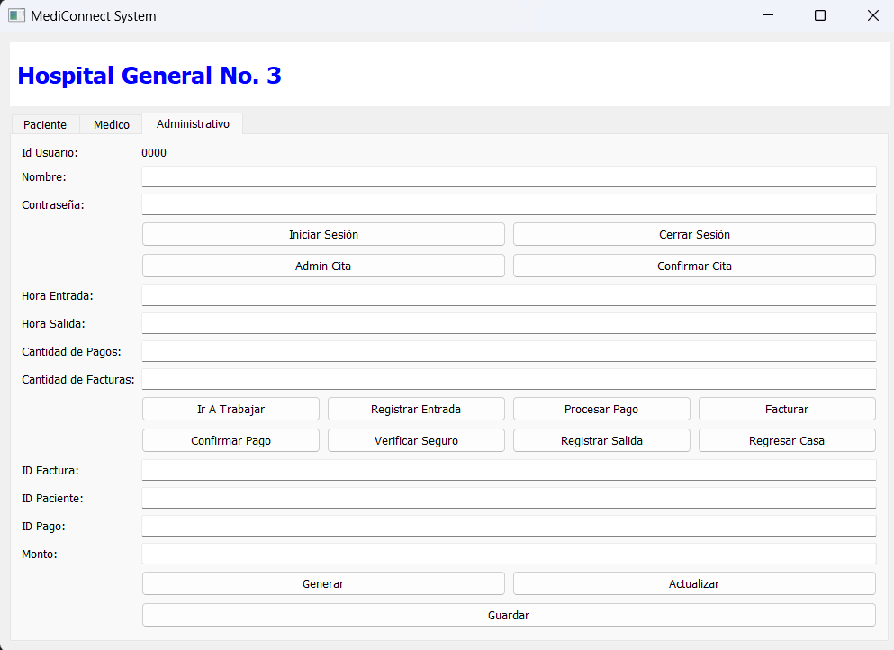
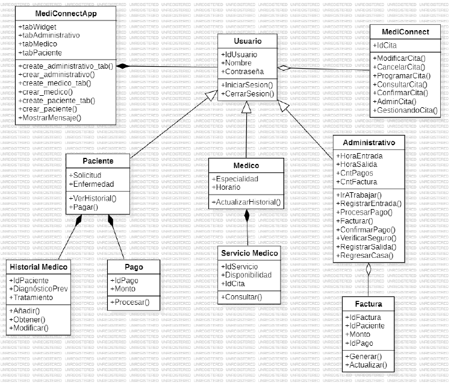

# SOLID

## 📜 **Description**

This project demonstrates the application of the **SOLID principles** in Python through a series of examples. It also includes a PyQt5-based application as part of the project, showcasing how the principles are applied in a graphical user interface (GUI) context.

---

## 🗋 **Table of Contents**

1. [What are the SOLID Principles?](#solid-principles)
2. [Examples in the Project](#examples)
3. [How to Run the PyQt5 Project](#running-the-project)
4. [Screenshots](#screenshots)

---

## 🛠️ **What are the SOLID Principles?** <a name="solid-principles"></a>

The **SOLID** principles are guidelines to create scalable, maintainable, and flexible object-oriented software. Here’s a quick breakdown:

1. **S - Single Responsibility Principle (SRP):**

   - Every class should have only one reason to change.
   - Example: A `Logger` class should only handle logging, not data processing.

2. **O - Open/Closed Principle (OCP):**

   - Software entities should be open for extension, but closed for modification.
   - Example: Using inheritance or polymorphism instead of modifying existing code.

3. **L - Liskov Substitution Principle (LSP):**

   - Subtypes must be substitutable for their base types without breaking the program.
   - Example: Derived classes must implement all expected behaviors of the base class.

4. **I - Interface Segregation Principle (ISP):**

   - A class should not be forced to implement methods it doesn’t use.
   - Example: Splitting a large interface into smaller, more specific ones.

5. **D - Dependency Inversion Principle (DIP):**
   - High-level modules should not depend on low-level modules. Both should depend on abstractions.
   - Example: Use dependency injection to decouple components.

---

## 🔍 **Examples in the Project** <a name="examples"></a>

Each principle is illustrated with a Python program in this repository:

- **`S.py`:** Shows how to refactor code to adhere to SRP.
- **`O.py`:** Demonstrates extending functionality without altering the existing code.
- **`L.py`:** Ensures that subclasses behave consistently with the base class.
- **`I.py`:** Refactors large interfaces into smaller ones.
- **`D.py`:** Implements dependency injection to improve modularity.

Each script is commented to explain how it aligns with its respective principle.

---

## 🚀 **How to Run the PyQt5 Project** <a name="running-the-project"></a>

1. Install **PyQt5**:

   ```bash
   pip install PyQt5
   ```

2. Run the main PyQt5 project file:

   ```bash
   python main.py
   ```

3. Features of the PyQt5 app:
   - A GUI demonstrating dynamic behavior based on SOLID principles.
   - Modular code with separate classes for UI logic, data handling, and business rules.

---

## 🖼️ **Screenshots** <a name="screenshots"></a>

_The project is about an interface focused on a hospital management system called "MediConnect," specifically designed for "Hospital General No. 3." It offers navigation divided into three main categories: Patient, Doctor, and Administrative. It is based on the SOLID methodology, with corresponding documentation and examples, including diagrams such as class diagram._

- The app's main interface.
  
- Class diagram
  

---

## 📚 **References**

- [PyQt5 Documentation](https://riverbankcomputing.com/software/pyqt/intro)
- R. C. Martin, Agile Software Development: Principles, Patterns, and Practices. USA: Prentice Hall PTR, 2003.

---
